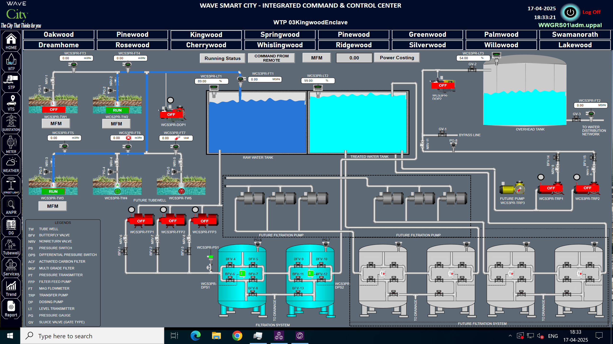

# Industrial Analytics – Work Methodology Demos

This repository contains **methodology demonstration projects** that replicate real-world data analytics workflows used in **industrial, utilities, and smart city environments**.

These demos are designed to showcase **how analytics is applied in production-like systems**, focusing on **problem framing, data modeling, analysis approach, and business impact**, rather than exposing real operational data.

---

## ⚠️ Data Confidentiality & Compliance Notice

- All datasets used are **synthetic, anonymized, or masked**
- No proprietary, confidential, or production data is included
- No live systems, credentials, endpoints, or customer-identifiable information are exposed
- System visuals are **representative demo views**, used only for contextual understanding

> This repository demonstrates **analytical methodology**, not actual company data.

---

## System Context – Industrial & Smart City Operations (Demo View)

The visualization below provides **system-level context** for the analytics demonstrated in this repository.

⚠️ **Disclaimer:**  
This is a **representative SCADA-style visualization** used purely for demonstration and educational purposes.  
- Not a live system  
- Not a production dashboard  
- No real-time operational data  

### What this visualization represents
- Borewell → Raw Water Tank → Treatment → Overhead Tank → Distribution flow
- PLC / IoT-based instrumentation (flow meters, level transmitters, pump status)
- Typical data sources feeding historians and analytics pipelines (e.g., AVEVA Historian–style systems)

### How analytics connects to this system
- Borewell health monitoring and leakage detection
- Flow imbalance and efficiency analysis
- Historian-style time series analysis using Python
- Data-driven operational and maintenance insights

---

## Projects Included

### 1️⃣ Complaint TAT Breach Analysis
**Tools:** Python, Pandas, Plotly  

**Description:**  
Demonstrates analysis of complaint resolution Turnaround Time (TAT) to identify SLA breaches, category-level delay patterns, and workflow inefficiencies in a smart city operations context.

**Key Highlights:**
- Identification of TAT breach percentage
- Category-wise performance and delay analysis
- Insight generation to support workflow redesign and SLA improvement
- Business-oriented interpretation of operational KPIs

---

### 2️⃣ Electricity Consumption & Cost Analysis
**Tools:** Python, Pandas, Time Series Analysis  

**Description:**  
Presents a historian-style time series analysis of electricity consumption and cost patterns across multiple financial years to support energy optimization and cost control decisions.

**Key Highlights:**
- Financial year–based aggregation of electricity consumption
- Unit consumption and electricity cost estimation
- Detection of inefficiencies and optimization opportunities
- Analytics aligned with real-world energy management use cases

---

### 3️⃣ Borewell Health & Leakage Analysis
**Tools:** Python, Pandas, Exploratory Data Analysis (EDA)  

**Description:**  
Demonstrates exploratory and diagnostic analysis of borewell performance using API-style water data, replicating real-world monitoring of borewell health and operational efficiency.

**Key Highlights:**
- Borewell-level performance assessment
- Identification of abnormal usage and inefficient borewells
- Support for proactive maintenance planning
- Reduction of downtime through data-driven insights

---

## Tools & Technologies
- Python (Pandas, NumPy)
- Plotly / Matplotlib
- Exploratory Data Analysis (EDA)
- Time Series Analysis
- Industrial / Historian-style Data Modeling
- Smart City & Utilities Analytics Concepts

---

## About This Repository

These projects are **demo implementations inspired by real-world analytics work performed in production environments** within utilities and smart city operations.

The goal is to demonstrate:
- Structured analytical thinking
- End-to-end data analysis workflows
- Translation of raw operational data into business impact
- Understanding of industrial and IoT-driven systems

This approach reflects **enterprise-grade analytics practices**, where confidentiality, compliance, and methodology matter as much as technical skills.

---

## Author

**Vishal Kumar Puri**  
📍 Delhi, India  

🔗 LinkedIn: https://www.linkedin.com/in/vishal-kumar-puri-846ba5288  
🔗 GitHub: https://github.com/vviiishu  

---

### 📌 Note for Recruiters & Reviewers
This repository is intended to **demonstrate analytical capability and system understanding**.  
While real datasets cannot be shared due to confidentiality, the **logic, approach, and insights mirror production-grade analytics work**.
